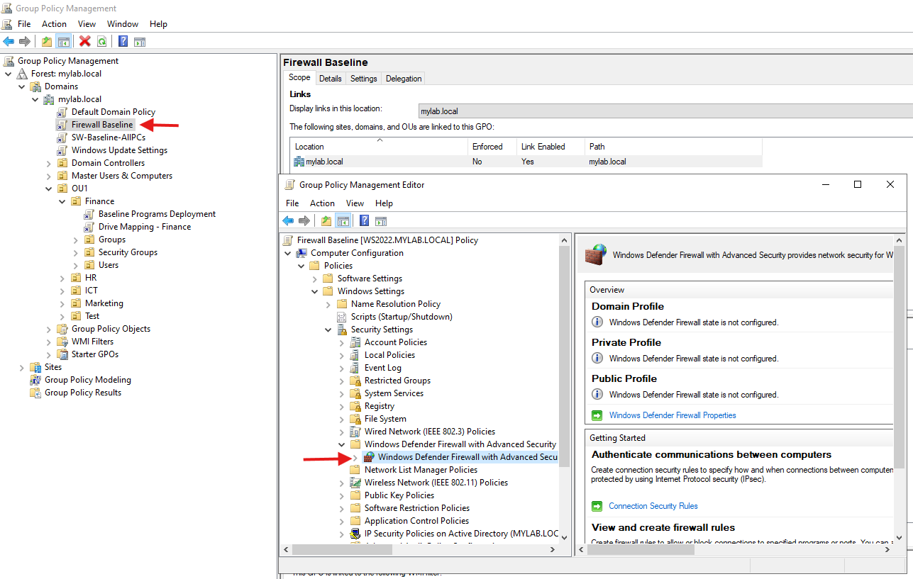
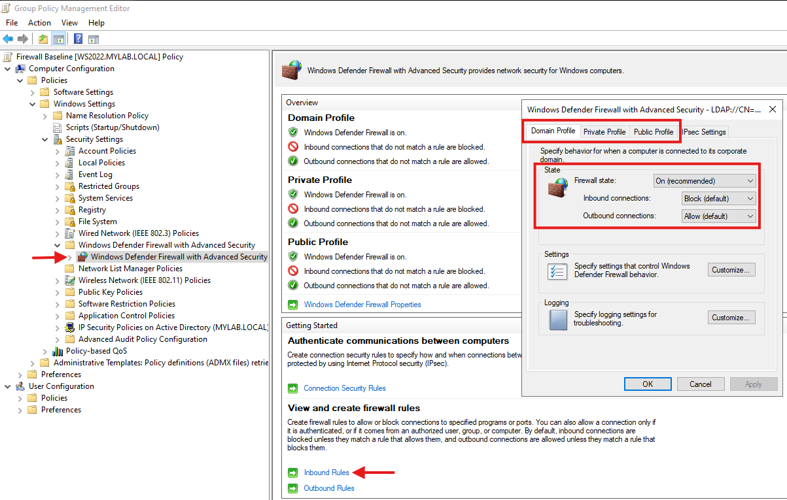
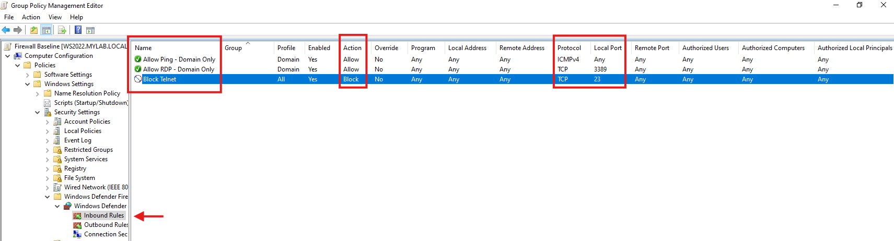
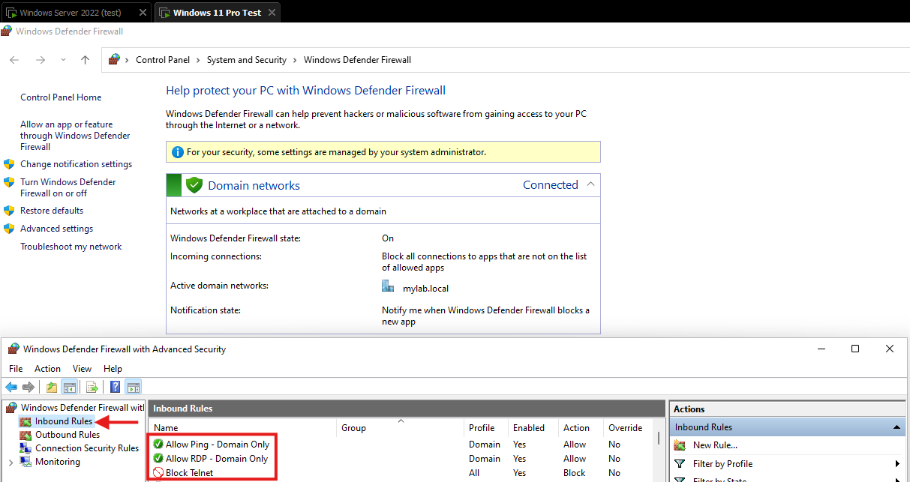
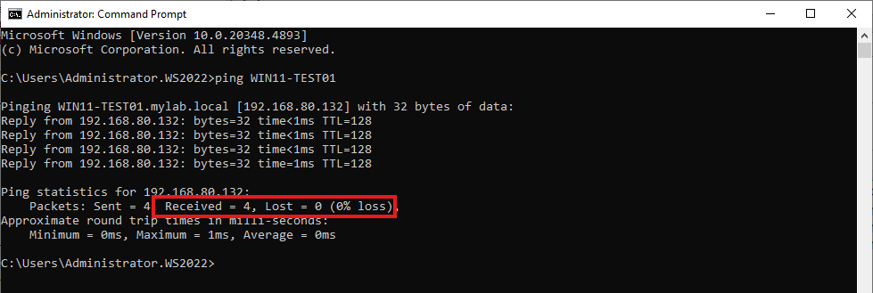
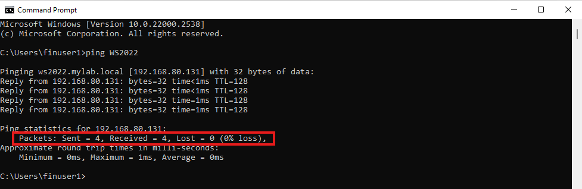
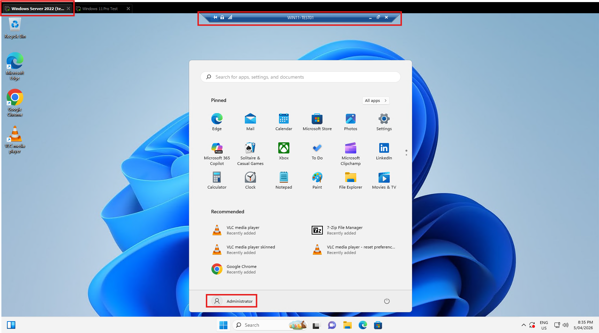
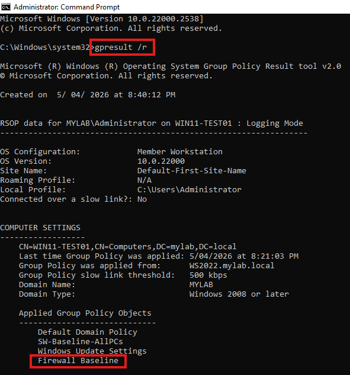

# Windows Firewall GPO Baseline — MYLAB.LOCAL

Centrally managed Windows Defender Firewall baseline for domain-joined machines, deployed via Group Policy. Enforces a deny-by-default inbound model with scoped allow rules for RDP and ICMP, plus an explicit block rule for legacy insecure protocols.

## What this project demonstrates

- Group Policy design for Windows Defender Firewall with Advanced Security
- Deny-by-default inbound posture aligned with Essential Eight hardening principles
- Firewall profile scoping (Domain vs Private vs Public) for network-aware rule enforcement
- Rule authoring for port-based protocols (TCP) and non-port-based protocols (ICMPv4)
- Layered verification using `wf.msc`, ping, RDP, and `gpresult`
- Troubleshooting methodology including network profile detection and DNS dependencies

## Lab environment

| Component | Detail |
|---|---|
| Domain controller | WS2022.mylab.local (Windows Server 2022 Datacenter) |
| Client | WIN11-TEST01 (Windows 11 Pro, domain-joined) |
| Platform | VMware Workstation |
| Domain | mylab.local |
| GPO scope | Linked at domain root — applies to all domain machines |

---

## Overview

This GPO centrally manages Windows Defender Firewall across all domain machines. It enforces a **deny by default, allow by exception** model — all inbound connections are blocked unless explicitly permitted by a rule. Outbound connections are allowed so normal operations (web browsing, DNS, file shares, GPO processing) are not disrupted.

### Rules summary

| Rule | Direction | Protocol / Port | Action | Profile |
|---|---|---|---|---|
| Allow RDP | Inbound | TCP 3389 | Allow | Domain only |
| Allow Ping (ICMPv4) | Inbound | ICMPv4 Echo Request | Allow | Domain only |
| Block Telnet | Inbound | TCP 23 | Block | All |

---

## 1. Create and link the GPO

1. On the DC, open **Group Policy Management** (`gpmc.msc`).
2. Expand Forest → Domains → **mylab.local**.
3. Right-click **mylab.local** → **Create a GPO in this domain, and Link it here**.
4. Name it **Firewall Baseline**.
5. Right-click **Firewall Baseline** → **Edit**.



---

## 2. Enable all firewall profiles

1. Navigate to: **Computer Configuration → Policies → Windows Settings → Security Settings → Windows Defender Firewall with Advanced Security**.
2. Click **Windows Defender Firewall with Advanced Security** in the left pane.
3. Click **Windows Defender Firewall Properties** (or right-click → Properties).
4. On each tab (**Domain**, **Private**, **Public**), set:
   - **Firewall state:** On
   - **Inbound connections:** Block
   - **Outbound connections:** Allow
5. Click **Apply** → **OK**.



> **Why block inbound?** A workstation has no reason to accept unsolicited incoming connections — it's not a server. Blocking inbound by default prevents lateral movement (an attacker compromising one PC and reaching others via open ports). You then create specific allow rules only for traffic you've explicitly decided to permit.

> **Why allow outbound?** Blocking outbound would break web browsing, DNS queries, file share access, Windows Update, and GPO processing itself. Some high-security environments block outbound by default and whitelist specific destinations, but that's complex to manage and overkill for a standard SOE.

> **Does "Block inbound" break everything?** No. It only blocks *unsolicited* inbound connections. Traffic that's part of an existing outbound connection (like a response from a web server you requested) still flows back fine — that's stateful firewall behaviour.

---

## 3. Create inbound rule — Allow RDP (Domain only)

This allows remote desktop connections to domain machines, but only when they're on the domain network.

1. In the left pane, expand **Windows Defender Firewall with Advanced Security**.
2. Right-click **Inbound Rules** → **New Rule**.
3. **Rule Type:** Port → Next.
4. **Protocol:** TCP → **Specific local ports:** `3389` → Next.
5. **Action:** Allow the connection → Next.
6. **Profile:** Tick **Domain** only (untick Private and Public) → Next.
7. **Name:** `Allow RDP - Domain Only` → Finish.

> **Why Domain profile only?** If a laptop is taken home or connected to public Wi-Fi, it switches to the Private or Public profile. By scoping RDP to Domain only, remote desktop is blocked outside the corporate network — preventing exposure on untrusted networks.

> **Inbound vs outbound for RDP:** The machine you're connecting *to* needs the inbound rule. The machine you're connecting *from* uses outbound, which is already set to Allow. So if you want to RDP into WIN11-TEST01 from the DC, it's WIN11-TEST01 that needs this inbound rule.

---

## 4. Create inbound rule — Allow Ping / ICMPv4 Echo Request

Windows Firewall blocks ping (ICMP) by default. This rule allows machines to respond to ping requests on the domain network, which is essential for basic network troubleshooting.

1. Right-click **Inbound Rules** → **New Rule**.
2. **Rule Type:** Custom → Next.
3. **Program:** All programs → Next.
4. **Protocol and Ports:**
   - **Protocol type:** Select **ICMPv4** from the dropdown.
   - Click **Customize** next to the ICMP settings.
   - Select **Specific ICMP types** → tick **Echo Request** → OK.
5. Click Next.
6. **Scope:** Leave as Any IP address for both local and remote → Next.
7. **Action:** Allow the connection → Next.
8. **Profile:** Tick **Domain** only (untick Private and Public) → Next.
9. **Name:** `Allow Ping - Domain Only` → Finish.

> **Why Custom rule and not Port?** ICMP is not a port-based protocol — it doesn't use TCP or UDP port numbers. The Port rule type only supports TCP and UDP, so you must use Custom to access the ICMPv4 protocol option.

> **Why only Echo Request?** ICMP has many message types (Echo Request, Echo Reply, Destination Unreachable, etc.). You only need to allow *Echo Request* inbound — the Echo Reply goes back as part of the existing connection (stateful). Allowing all ICMP types is unnecessary and slightly increases attack surface.

---

## 5. Create inbound rule — Block Telnet

Telnet sends credentials in plain text and should never be used. This rule explicitly blocks it as an example of a deny rule.

1. Right-click **Inbound Rules** → **New Rule**.
2. **Rule Type:** Port → Next.
3. **Protocol:** TCP → **Specific local ports:** `23` → Next.
4. **Action:** Block the connection → Next.
5. **Profile:** All (Domain, Private, Public all ticked) → Next.
6. **Name:** `Block Telnet` → Finish.

> **Isn't Telnet already blocked by the "Block inbound" default?** Yes — this rule is redundant in practice. It exists as an explicit policy statement and as an example of how to create block rules. In production, explicit block rules are used for documentation and auditing purposes, and they remain enforced even if someone accidentally changes the default inbound setting to Allow.



Close the Group Policy Management Editor.

---

## 6. Verify on the client

### 6.1 Apply the policy

On the client, open an elevated CMD and run:

```
gpupdate /force
```

### 6.2 Check the firewall rules

Open Windows Defender Firewall with Advanced Security on the client:

```
wf.msc
```

Click **Inbound Rules**. You should see your three rules:

| Rule Name | Action | GPO Icon |
|---|---|---|
| Allow RDP - Domain Only | Allow | Yes — policy-managed, cannot be locally deleted |
| Allow Ping - Domain Only | Allow | Yes — policy-managed, cannot be locally deleted |
| Block Telnet | Block | Yes — policy-managed, cannot be locally deleted |



The "some settings are managed by your system administrator" banner confirms the rules are policy-enforced, not locally configured.

### 6.3 Test ping

From the DC, ping the client:

```
ping WIN11-TEST01
```

This should now succeed. Before the GPO, this would have timed out because Windows Firewall blocks ICMP by default.



From the client, ping the DC:

```
ping WS2022
```

This tests outbound from the client (already allowed) and inbound on the DC. Because the DC also has the Firewall Baseline GPO applied, it responds.



### 6.4 Test RDP

From the DC or another domain machine, open Remote Desktop Connection:

```
mstsc
```

Connect to `WIN11-TEST01`. The connection should succeed if RDP is enabled on the client (RDP also needs to be enabled in System Properties → Remote tab — the firewall rule alone just opens the port).



### 6.5 Confirm GPO application

```
gpresult /r
```

Look under **Computer Settings → Applied Group Policy Objects** — you should see **Firewall Baseline**.



---

## Troubleshooting

### Ping still times out after applying the GPO

- Run `gpresult /r` on the target machine — is **Firewall Baseline** listed under Applied GPOs?
- Open `wf.msc` on the target — is the **Allow Ping - Domain Only** rule visible?
- Check which firewall profile is active. If the machine thinks it's on a Private or Public network (common in lab environments), the Domain-only rule won't apply. Run `Get-NetConnectionProfile` in PowerShell to check. If it shows Private, the machine may not be properly seeing the DC — check DNS settings.

### RDP connection refused

- The firewall rule opens the port, but RDP also needs to be **enabled** on the target machine: System Properties → **Remote** tab → tick **Allow remote connections to this computer**.
- Alternatively, enable via GPO: **Computer Configuration → Policies → Administrative Templates → Windows Components → Remote Desktop Services → Remote Desktop Session Host → Connections → Allow users to connect remotely by using Remote Desktop Services → Enabled**.

### Rules show in wf.msc but have no effect

- Check if there are conflicting local rules that might be overriding. GPO-deployed rules take precedence, but local rules can sometimes cause unexpected behaviour.
- Verify the firewall service is running: `sc query MpsSvc` — the state should show **RUNNING**.

### Wrong firewall profile is active

If the machine is on a Domain network but showing Private or Public profile, it can't see the DC properly. Check:

```
nslookup mylab.local
ipconfig /all
```

The primary DNS server must point to the DC's IP address. If DNS is misconfigured, Windows can't detect the domain network and falls back to Private or Public profile, which means Domain-scoped rules won't apply.

---

## Key concepts reinforced in this build

| Concept | Where it appears |
|---|---|
| Deny by default, allow by exception | Inbound blocked across all three profiles with scoped allow rules |
| Profile-aware rule scoping | RDP and ICMP allowed on Domain profile only; blocked on Private/Public |
| Stateful firewall behaviour | Outbound responses flow back without explicit inbound rules |
| Policy as documentation | Explicit Block Telnet rule despite default-deny inbound |
| Essential Eight alignment | Application hardening and user application hardening via centralised baseline |
| Network profile dependencies | Correct DNS required for Domain profile detection |
